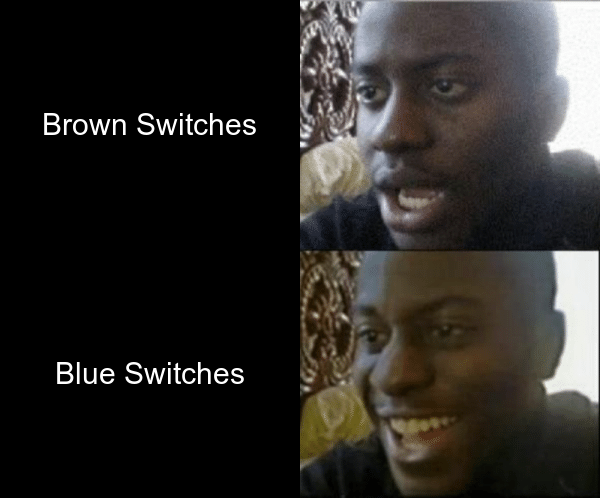

# My Index File

## My Meme



I created this since I am a Mechanical Keyboard enthusiast. I added the text to an exisitng meme format/template in order to create an orignal image.

* Love blue switches
* Tolerate red switches
* Dislike brown switches

Here is a cat


## My Code


```
library(magick)

brownswitches <- image_blank(width = 300,
                     height = 249,
                     color = "#000000") %>%
  image_annotate(text="Brown Switches", 
                 color = "#FFFFFF",
                 size = 30,
                 font="Arial",
                 gravity = "center")

blueswitches <- image_blank(width = 300,
                             height = 249,
                             color = "#000000") %>%
  image_annotate(text="Blue Switches", 
                 color = "#FFFFFF",
                 size = 30,
                 font="Arial",
                 gravity = "center")

reactionhappy <- image_read("https://pics.me.me/thumb_disappointed-black-guy-reverse-blank-template-imgflip-51233219.png")

switchvector <- c(brownswitches, blueswitches)

left <- image_append(switchvector, stack = TRUE)


meme <- c(left, reactionhappy)%>%
  image_append(stack=FALSE)


image_write(meme, "mine.png")
```
